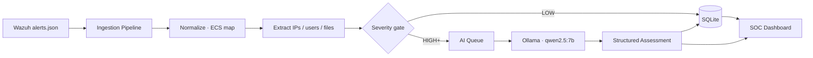
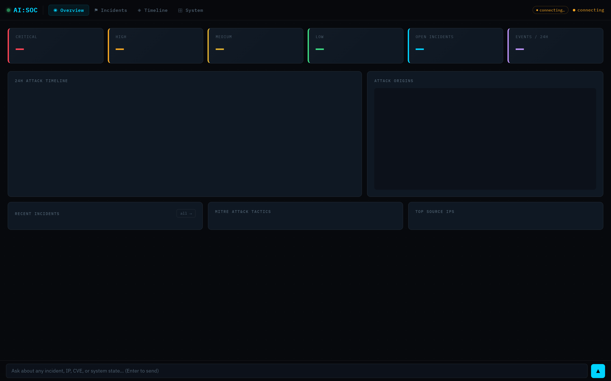
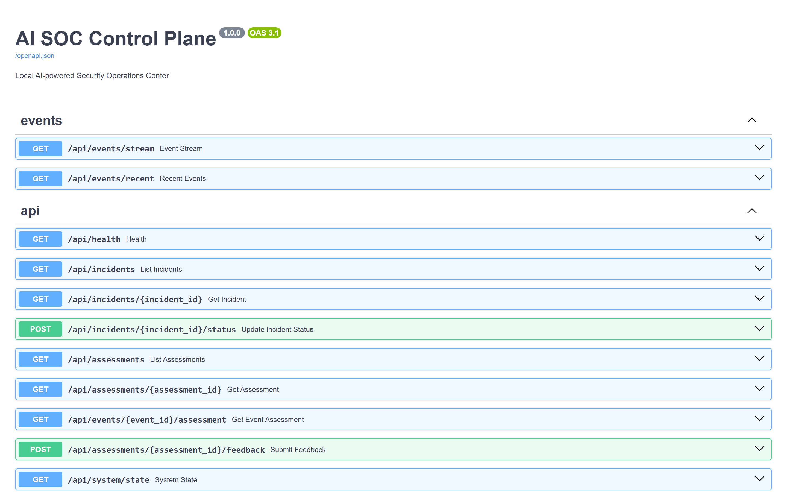

# AI SOC Control Plane

<p>


</p>

**A Security Operations Center that runs entirely on your laptop.** No cloud, no API keys, no data leaving your network. Wazuh alerts go in, a local Ollama model reads them in context, and you get structured incident assessments telling you exactly what happened, why it matters, and what to do.



**Detects:** SSH brute force · file integrity tampering · rootkit indicators · privilege escalation · suspicious port openings · honeytoken access. **Correlates** by entity (IP, user, file). **Learns** from your false-positive feedback without retraining.

---

## See it work

The dashboard (cyberpunk-styled, dark, low-noise) and the underlying API:

<p>


</p>

Run aicp against the bundled sample alerts and it produces real, structured AI assessments. Here's an unedited example from a fresh boot (the model is the 3B `hermes3:3b` running locally — no API, no cloud):

```json
{
  "severity": "high",
  "confidence": 0.9,
  "summary": "Multiple SSHD authentication failures from IP 185.220.101.47",
  "incident_type": "brute_force",
  "mitre_technique": "T1110.001",
  "narrative": {
    "assessment": "It is likely that this IP address is conducting a brute force attack against the SSH service, trying various passwords to gain unauthorized access.",
    "risk": "If left unaddressed, the attacker may eventually succeed in gaining access to the system, potentially leading to data exfiltration or other malicious activities.",
    "recommended_actions": [
      "Block the source IP from accessing the SSH service",
      "Monitor for further attempts and escalate if necessary"
    ]
  },
  "model_used": "hermes3:3b",
  "inference_ms": 77846
}
```

Full sample at [`docs/sample-assessment.json`](docs/sample-assessment.json).

---

## Requirements

| Component | Minimum | Recommended |
|-----------|---------|-------------|
| RAM | 8 GB | 16 GB+ |
| CPU | 2 cores | 4+ cores |
| Disk | 20 GB | 50 GB+ |
| OS | Ubuntu 22.04 | Ubuntu 24.04 |

**Required software:**
- Python 3.11+
- Docker + Docker Compose v2
- Ollama (runs on host, not in Docker)

---

## Quick Start

### 1. Install Ollama and pull a model

```bash
# Install Ollama
curl -fsSL https://ollama.com/install.sh | sh

# Pull the recommended analyst model (needs ~5GB RAM)
ollama pull qwen2.5:7b

# Start Ollama
ollama serve
```

### 2. Clone and configure

```bash
git clone <your-repo>
cd aicp

# Copy and review config
cp .env.example .env   # or edit .env directly
```

### 3. Run in development mode (sample alerts, no Docker needed)

```bash
pip install -r requirements.txt

# .env already points at tests/fixtures/sample_alerts.json
python main.py

# Open http://localhost:8000
```

On first boot, you'll see an environment briefing. Click "Start AI:SOC →" to proceed.

The sample alerts include: SSH brute force, FIM changes, rootkit detection, CVE, privilege escalation. Within ~60 seconds you'll see AI assessments appear in the incident feed.

### 4. Run with real Wazuh (full stack)

```bash
# Edit .env — change Wazuh path
WAZUH_ALERTS_PATH=/var/ossec/logs/alerts/alerts.json

# Start everything
docker compose up -d

# Check status
docker compose ps

# Open http://localhost:8000
```

---

## Architecture

```
aicp/
├── main.py                   FastAPI app + lifespan + background tasks
├── core/
│   ├── config.py             All settings (env-driven)
│   ├── models.py             All dataclasses and enums
│   ├── database.py           SQLite — all queries
│   ├── event_bus.py          Async SSE fanout hub
│   └── onboarding.py         First-boot environment analysis
├── collectors/
│   ├── wazuh.py              Tails alerts.json (rotation-aware)
│   └── snapshot.py           System state capture + port change detection
├── pipeline/
│   ├── normalizer.py         Raw alert → typed Event (ECS mapping)
│   ├── extractor.py          Entity extraction (IPs, users, files, …)
│   ├── classifier.py         Severity filter + honeytoken detection
│   ├── fanout.py             DB write + SSE bus + AI queue
│   └── ingestion.py          Orchestrates all 5 stages
├── analyst/
│   └── analyst.py            ContextBuilder, OllamaInference,
│                             IncidentManager, AIAnalystWorker
├── api/
│   ├── events.py             GET /api/events/stream (SSE)
│   └── routes.py             All other endpoints
└── frontend/
    └── index.html            SOC dashboard (three-column layout)
```

### Event ingestion pipeline

```
Raw alert (Wazuh JSON)
       ↓
Stage 2: Normalize     — ECS field mapping, severity, event type
       ↓
Stage 3: Extract       — IPs, users, files, containers, ports, CVEs
       ↓
Stage 3.5: Honeytoken  — /tmp/id_rsa accessed? → CRITICAL, skip filter
       ↓
Stage 4: Classify      — HIGH → analyze, MEDIUM → analyze if correlated, LOW → store
       ↓
Stage 5: Fanout        — SQLite | SSE bus | AI queue
```

### AI analysis

The AI analyst runs **one inference at a time** (priority queue, max 50 jobs).

Priority: CRITICAL (1) > HIGH (2) > MEDIUM (3). LOW never analyzed automatically.

For each qualifying event, the context builder:
1. Extracts entities (IPs, users, files)
2. Queries all events from the same entities in the last 24h
3. Gets the latest system snapshot
4. Injects known false positive patterns from operator feedback
5. Builds a structured prompt

The model (`qwen2.5:7b`) runs at `temperature: 0.1` for deterministic security analysis. Output is validated against a pydantic schema before storing.

### Honeytoken detection

Files that should never be legitimately accessed. Any FIM event on these paths → immediate CRITICAL, bypasses normal severity filter:

- `/tmp/id_rsa`
- `/tmp/.secret_key`
- `/root/.aws/credentials`
- `/tmp/passwords.txt`

Add custom honeytokens via the `honeytokens` table in SQLite.

---

## API Reference

| Endpoint | Method | Description |
|----------|--------|-------------|
| `/api/events/stream` | GET | SSE stream of all events and assessments |
| `/api/events/recent` | GET | Recent event history |
| `/api/incidents` | GET | List incidents |
| `/api/incidents/{id}` | GET | Single incident with events + assessments |
| `/api/incidents/{id}/status` | POST | Update status (resolve, close) |
| `/api/assessments` | GET | Recent AI assessments |
| `/api/assessments/{id}/feedback` | POST | Submit feedback (confirmed/false_positive/investigate) |
| `/api/system/state` | GET | Current system state (snapshot + counts) |
| `/api/system/events` | GET | Recent raw events from DB |
| `/api/system/models` | GET | Loaded Ollama models |
| `/api/chat` | POST | Streaming chat with system context |
| `/api/onboarding` | GET | First-boot environment report |
| `/api/health` | GET | Service health check |
| `/docs` | GET | Interactive API documentation |

---

## Configuration

All settings are in `.env`. The most important ones:

```bash
# Switch to real Wazuh (production)
WAZUH_ALERTS_PATH=/var/ossec/logs/alerts/alerts.json

# Change model (must be pulled in Ollama first)
OLLAMA_MODEL=qwen2.5:14b

# Point at Ollama in Docker (if running Ollama in container)
OLLAMA_URL=http://host.docker.internal:11434

# Tune alert filtering
ALWAYS_ANALYZE_LEVEL=10    # Wazuh level >= 10 always goes to AI
CONDITIONAL_LEVEL=7        # Level 7-9 only if entity seen recently
```

---

## Feedback loop

When you mark an AI assessment as **False Positive**:
1. All entity patterns from that event (IPs, users, files) are stored in `feedback_patterns`
2. Future AI prompts for similar events include: _"This pattern was marked false positive N times on this system"_
3. The model reduces its confidence score accordingly

This makes the system smarter over time without retraining anything.

---

## Database

SQLite file at `aicp.db` (or `DB_PATH` in `.env`).

```
events              all ingested events (30 day retention)
event_entities      entity index for fast correlation queries
assessments         AI analysis outputs
incidents           grouped event clusters
system_snapshots    hourly system state
feedback_patterns   false positive learning
honeytokens         files that should never be accessed
identities          operator identity definitions
identity_accounts   per-device accounts mapped to identities
ai_audit_log        every AI interaction (prompt + response)
```

Inspect with: `sqlite3 aicp.db` or DB Browser for SQLite.

---

## Troubleshooting

**Dashboard loads but no incidents appear**

Check if the tailer is reading the alerts file:
```bash
python -c "
import asyncio
from collectors.wazuh import AlertsTailer
async def test():
    tailer = AlertsTailer()
    async for alert in tailer.tail():
        print(alert.get('rule',{}).get('description',''))
        break
asyncio.run(test())
"
```

**AI analysis never appears**

Check if Ollama is reachable:
```bash
curl http://localhost:11434/api/tags
```

Check the model is pulled:
```bash
ollama list
```

Check the AI queue isn't stuck:
```bash
curl http://localhost:8000/api/health
```

**Wazuh container won't start**

Check memory: `free -h`. Wazuh needs ~2GB minimum.

Check logs: `docker compose logs wazuh-manager`

**Everything works in dev but not with Docker**

The app needs to reach Ollama on the host. Verify `host.docker.internal` resolves:
```bash
docker exec aicp curl http://host.docker.internal:11434/api/tags
```

---

## What's not built yet (v2)

- Multi-agent swarm (watcher / analyst / commander tiers)
- Statistical baseline learning (7-day normal behavior model)
- Automated remediation (block IP, restart container) with confirmation
- Cross-platform agent (Windows, macOS)
- Kernel telemetry (eBPF)
- External threat intelligence feeds
- Grafana integration
- Email / Slack notifications
